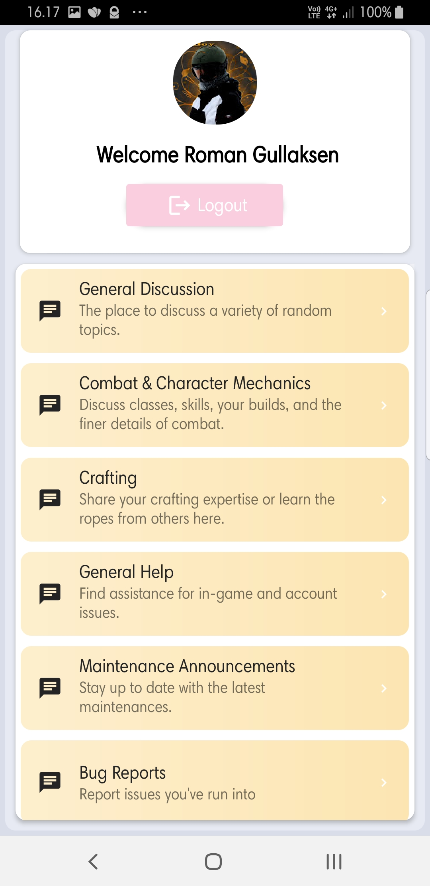
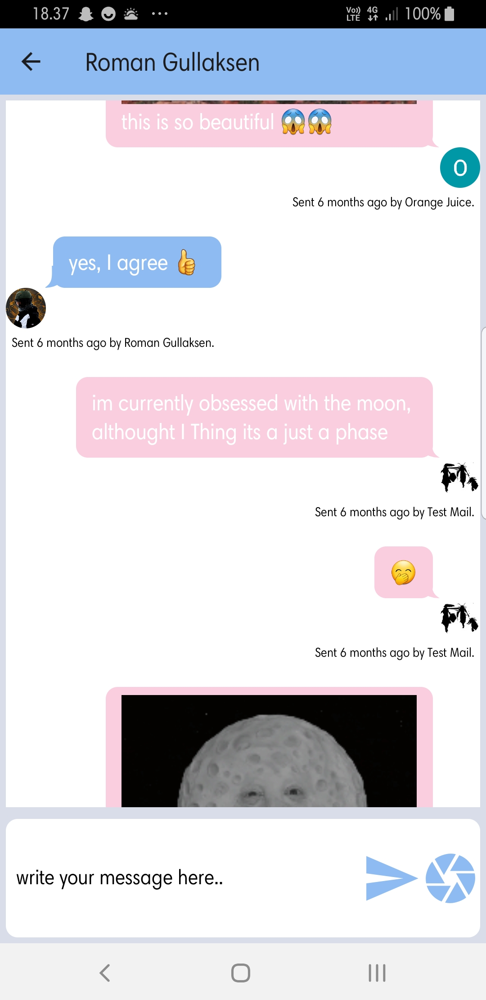

# FlowChat

The project is based on firebase. It’s a simple chat application that includes login
functionality and the possibility to join some predefined chat
rooms. When joining a room, the last 50 messages are loaded
and then new messages are added automatically as they come in.
The following task are implemented:

1. Splash screen ✔ ( only on android, since I don't have an 🍏 computer )
2. Login screen that silently tries to login if you are not logged out ✔
3. Chat rooms ✔
4. Open chat room ✔
5. Send and receive messages ✔

<p align="center">



</p>

## Getting Started

These instructions will get you a copy of the project up and running on your local machine for development and testing purposes.
This is only tested on an android device!

### Prerequisites

The things you need before you can run the app.

- Node
- The React Native command line interface
- A JDK, and Android Studio.

For A step by step guide that will tell you how to get the development environment up and running see:
<https://reactnative.dev/docs/environment-setup>

### Installation & Usage

Make sure your device is shown when running: `$adb devices` before running the commands below.
For getting the app running on a device run:

```
git clone https://github.com/made-from-organic-orange-juice/FlowChat
cd FlowChat
npm install
npx react-native start (terminal 1)
npx react-native run-android (terminal 2)
```
